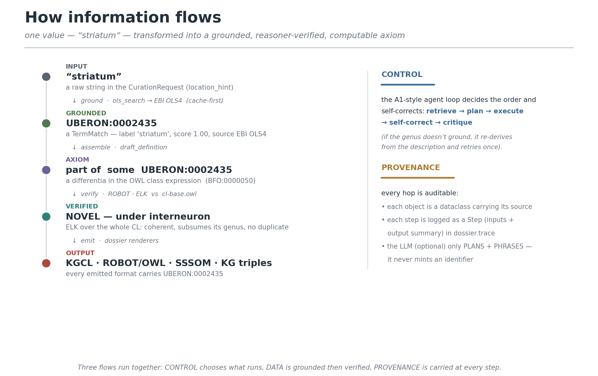

# CellScribe — Full Documentation

> A grounded, agentic assistant for **Cell Ontology (CL)** curation.
> LLM speed, ontology rigour, curator‑in‑the‑loop — and it runs on a free LLM (or none at all).

This document explains **every part** of CellScribe: the design, the data model, each
module and tool, the reasoning layer, the LLM integrations, the outputs, the CLI, the
programmatic API, and **all 55 tests** — each with runnable examples.

- Package: `cellscribe` (version `0.2.0`), Python ≥ 3.8, one hard dependency (`requests`).
- Repo layout is described in [§13](#13-repository-map).
- For the one‑page overview see [README.md](README.md); this file is the deep reference.

---

## Table of contents

1. [What it is & the design bet](#1-what-it-is--the-design-bet)
2. [Install & 60‑second quick start](#2-install--60-second-quick-start)
3. [Architecture: the agent loop + tool registry](#3-architecture-the-agent-loop--tool-registry)
4. [Data model (every dataclass)](#4-data-model)
5. [The curation pipeline, step by step](#5-the-curation-pipeline-step-by-step)
   - [5.1 Mechanism & information flow — the three flows](#51-mechanism--information-flow--the-three-concurrent-flows)
6. [The tools (one section each)](#6-the-tools)
7. [Grounding & the offline cache](#7-grounding--the-offline-cache)
8. [The reasoning layer (ELK / ROBOT)](#8-the-reasoning-layer)
9. [The LLM layer (optional, pluggable, free‑tier‑friendly)](#9-the-llm-layer)
10. [Ecosystem hand‑offs (OntoGPT / DRAGON‑AI / Aurelian)](#10-ecosystem-hand-offs)
11. [Outputs: 8 CL‑native formats](#11-outputs-8-cl-native-formats)
12. [CLI reference (every command & flag)](#12-cli-reference)
13. [Repository map](#13-repository-map)
14. [Tests — all 55 explained](#14-tests--all-55-explained)
15. [Benchmark](#15-benchmark)
16. [Extending CellScribe](#16-extending-cellscribe)
17. [Limitations & roadmap](#17-limitations--roadmap)

---

## 1. What it is & the design bet

Curating the Cell Ontology means, for each cell type, producing a **computable
genus–differentia definition**: a genus (parent CL class) plus differentiating
restrictions (`part_of` an anatomical structure, `capable_of` a GO process, `has plasma
membrane part` a protein, …), all as **real ontology identifiers**, plus prose, evidence,
and provenance. It is careful, standards‑bound work.

CellScribe's bet: **an LLM should never invent an ontology term.** Every identifier comes
from a grounding tool against a real service (EBI OLS4, QuickGO, NCBITaxon). The optional
LLM only does two things that need judgement — **planning** the tool order and **phrasing**
the definition — and even the phrasing is constrained to the grounded facts. A reasoner
(ELK via ROBOT) then **verifies** the draft against the actual ontology. A human curator
always makes the final call.

It is **Biomni‑inspired** (Stanford's biomedical agent): a *declarative tool registry* +
an *A1‑style agent loop* (`retrieve → plan → execute → self‑correct → critique`). Where
Biomni‑A1 narrows ~150 tools per task, CellScribe narrows a small, domain‑specific set —
but the mechanism is the same and scales.

**Design invariants** (why you can trust the output):
- Every returned object is a small, JSON‑serialisable dataclass that **carries its provenance** ([§4](#4-data-model)).
- The whole run is **traced** — every step is a `Step` with inputs and an output summary.
- It is **useful with no LLM and no network**: deterministic planning + shipped fixtures.

---

## 2. Install & 60‑second quick start

```bash
# from the repo root (cellscribe_tool/)
pip install -e .                 # installs the `cellscribe` CLI + the package
# optional extras:
pip install -e '.[markers]'      # pandas/numpy for matrix-based marker panels
pip install -e '.[nsforest]'     # the real NS-Forest (else a built-in re-implementation)
```

**Run the two bundled worked examples, fully offline (uses shipped fixtures):**

```bash
python run_demo.py               # offline by default; --online to refresh; --no-llm to force deterministic
# or, equivalently, via the CLI:
cellscribe demo --offline --no-llm
```

You'll see Example A (`CD4-positive, alpha-beta T cell`) resolve to **ALIGN** (it already
exists as `CL:0000624`) and Example B (`striatal parvalbumin-positive GABAergic
interneuron`) resolve to **PROPOSE**, with a marker panel scored `F-beta 1.00` on a bundled
synthetic matrix.

**Curate one cell type from the command line:**

```bash
cellscribe curate \
  --name "striatal parvalbumin-positive GABAergic interneuron" \
  --markers "GAD1,GAD2,PVALB" --functions "GABA biosynthetic process" \
  --location "striatum" --organism "Homo sapiens" \
  --out out/
```

**Use it as a library:**

```python
from cellscribe import CuratorAgent, CurationRequest
dossier = CuratorAgent(offline=False, use_llm=False).curate(CurationRequest(
    name="striatal parvalbumin-positive GABAergic interneuron",
    markers=["GAD1", "GAD2", "PVALB"],
    functions=["GABA biosynthetic process"],
    location_hint="striatum", organism="Homo sapiens"))
print(dossier.critique.disposition, dossier.parent.curie, dossier.panel.score)
```

---

## 3. Architecture: the agent loop + tool registry

```
INPUT (CurationRequest)
        │
        ▼
┌─────────────────────────── Agent core (A1-style loop) ───────────────────────────┐
│   retrieve ──► plan ──► execute ──► self-correct ──► critique                     │
│   (registry.select)  (LLM or default order)   (re-derive genus on miss)           │
└───────────────────────────────────────────────────────────────────────────────── ┘
        │ calls, in a planned order, the …
        ▼
  Tool registry (declarative ToolSpecs)         Grounding / evidence services
  • ols_search           ────────────────────►  EBI OLS4   (CL / Uberon / GO / PR)
  • literature_search    ────────────────────►  Europe PMC
  • marker_panel (NS-Forest)                     (local matrix, optional)
  • go_marker_support    ────────────────────►  QuickGO
  • draft_definition     ─(optional)──────────►  LLM (Groq / OpenAI / Anthropic)
        │
        ├─►  Reasoning:  ROBOT · ELK  over  cl-base.owl  (the whole Cell Ontology)
        ▼
OUTPUT (CurationDossier) ──► 8 CL-native formats (KGCL, MIRACL, SSSOM, ROBOT, OWL, …)
```

Two objects drive everything:

- **`ToolRegistry`** (`registry.py`) holds `Tool`s, each described by a declarative
  `ToolSpec` (name, description, tags, input schema, returns). `registry.select(goal, k)`
  is a *transparent lexical scorer*: it tokenises the goal and each tool's
  name/description/tags and ranks by overlap — a real, inspectable retrieval step.
- **`CuratorAgent`** (`agent.py`) owns the registry, an `LLMClient`, and the offline flag,
  and implements `curate(request) -> CurationDossier` — the orchestration in [§5](#5-the-curation-pipeline-step-by-step).

---

## 4. Data model

Everything a tool returns is a small dataclass in **`models.py`** (all have `.to_dict()`).
Explicit shapes are the point — every object carries **where it came from**.

| Dataclass | Key fields | Meaning |
|---|---|---|
| **`TermMatch`** | `query, curie, iri, label, ontology, definition, synonyms, score, source` | An ontology term grounded via OLS, e.g. `CL:0000617` "GABAergic neuron". `score` is normalised 0–1. |
| **`Paper`** | `pmid, title, authors, journal, year, doi, url, snippet` | A Europe PMC hit; `snippet` is the extracted evidence sentence. |
| **`MarkerPanel`** | `markers, score, method, precision, recall, species, context, per_gene, note` | A minimal, specific marker set + `F-beta` score. **`context` and `species` matter** — markers are context‑dependent. |
| **`Definition`** | `label, textual, manchester_owl, obo_lines, robot_header, robot_row, relations, drafted_by` | The drafted entry: prose + computable OWL (Manchester) + a ROBOT template row. `drafted_by` is `"template"` or `"llm:<model>"`. |
| **`Critique`** | `confidence, needs_expert_review, disposition, checks, issues, recommendations` | The verification step's verdict (see dispositions below). |
| **`Step`** | `index, tool, action, inputs, output_summary, provenance` | One entry in the agent's audit trace. |
| **`CurationRequest`** | see below | The input. |

**`CurationRequest`** fields (all optional except `name`):

```python
name: str                       # required
description: str = ""
markers: List[str] = []         # transcriptomic (expression) markers  -> `expresses`
surface_markers: List[str] = [] # cell-surface proteins                -> `has plasma membrane part` (PRO)
functions: List[str] = []       # GO biological processes              -> `capable of`
components: List[str] = []      # GO cellular components               -> `has part`
location_hint: str = ""         # anatomy                              -> `part of` (Uberon)
parent_hint: str = ""           # genus hint                           -> grounded to CL
expr_csv: str = ""              # optional cells x genes matrix (+cluster col) for a real panel
cluster_col: str = "cluster"
target_cluster: str = ""
taxonomy_ref: str = ""          # e.g. a BICAN taxonomy id / dataset DOI (data-linked T-types)
reference_data: str = ""        # versioned reference-dataset link (CELLxGENE id + version)
orcid: str = ""                 # submitter ORCID (for the CL GitHub new-term issue)
organism: str = "Homo sapiens"
```

**The output** is a **`CurationDossier`** (`dossier.py`) — not "an answer" but a
*reviewable package*: `existing, parent, location, panel, papers, definition, functions,
surface, go_support, taxon, official_name, taxon_caveat, synonyms, critique, trace,
llm_used`, plus renderers ([§11](#11-outputs-8-cl-native-formats)).

**Dispositions** (set by the critic):
- `ALIGN to existing term — do not create a duplicate`
- `PROPOSE new term for curator approval`
- `INSUFFICIENT evidence — gather more before proposing`

---

## 5. The curation pipeline, step by step

`CuratorAgent.curate()` runs these steps and logs each as a `Step` in `dossier.trace`.
Numbers match the trace you see with `verbose=True`.

| # | Step | What happens | Grounds to |
|---|---|---|---|
| 0 | **retrieval** | `registry.select(goal, k=6)` ranks tools by lexical overlap with the goal. | — |
| 0b | **planner** | If an LLM is available, `plan_tools()` orders the selected tools (constrained to real names); else a default order. | LLM (optional) |
| 1 | **existing‑term check** | OLS search of the *name* in CL; only `CL:` hits count (an imported anatomy/GO term is not a cell type). Drives ALIGN vs PROPOSE. | EBI OLS4 (CL) |
| 2 | **genus grounding (+self‑correct)** | Derive a genus from name/description (`parent_hint` wins), ground in CL; **on a miss, re‑derive from the description and retry once.** | EBI OLS4 (CL) |
| 3 | **location grounding** | Ground `location_hint` in Uberon. | EBI OLS4 (Uberon) |
| 4 | **literature** | Europe PMC search (query cascade, organism‑scoped) → up to 5 `Paper`s with evidence snippets. | Europe PMC |
| 5 | **marker panel** | If `expr_csv` given → NS‑Forest on the matrix; else a prior‑based score from the marker list + literature co‑mention. **Only transcriptomic markers** become `expresses`. | local / NS‑Forest |
| 6 | **GO functions & surface markers** | Ground `functions` in GO (`capable of`) and `surface_markers` in PRO (`has plasma membrane part`); unverified surface markers are recorded, not asserted. | EBI OLS4 (GO, PRO) |
| 6b | **GO × marker** | QuickGO: which markers a defining GO function actually annotates (evidence ECO:0000269/0000318). | QuickGO |
| 7 | **draft definition** | Genus–differentia template → prose + Manchester OWL + ROBOT row; if an LLM is present, replace the prose with a CL‑house‑style paragraph (grounded facts only). | template / LLM |
| 8 | **taxon & naming** | Ground organism in NCBITaxon, add a taxon caveat for broadly‑conserved genera, suggest an official name / flag transfer‑style names. | NCBITaxon |
| 9 | **critique** | Score grounding / duplication / support → `confidence`, `needs_expert_review`, `disposition`. | — |

**Real trace** (Example B, deterministic, offline — these are the actual `Step.index`
values you see with `--offline --no-llm`; the conceptual step numbers above map onto them):

```
[1]  retrieval        selected tools — marker_panel, literature_search, go_marker_support, ols_search, draft_definition
[2]  planner          planned steps — ols_search -> literature_search -> marker_panel -> draft_definition (default)
[3]  ols_search       existing-term check in CL — no CL match
[4]  ols_search       ground parent/genus in CL — interneuron (CL:0000099) 1.00
[5]  ols_search       ground location in Uberon — striatum (UBERON:0002435) 1.00
[6]  literature_search Europe PMC evidence — 5 papers
[7]  marker_panel     test marker specificity — panel=[GAD2, PVALB, GAD1] score=1.00 (NS-Forest-style)
[8]  ols_search       ground functions in GO — GABA biosynthetic process (GO:0009449)
[9]  go_marker_support GO x marker (QuickGO) — GAD1<-GO:0009449, GAD2<-GO:0009449
[10] draft_definition compose text + OWL + ROBOT
[11] taxon            ground organism — Homo sapiens (NCBITaxon:9606)
[12] critic           confidence=1.00 needs_review=False   → PROPOSE new term
```

The drafted prose for this run is:
*"An interneuron that is located in the striatum and capable of GABA biosynthetic process
and expressing GAD2, PVALB, GAD1 (in Homo sapiens)."* — with an LLM key present, step 7
replaces this with a CL‑house‑style paragraph, still from the grounded facts only.

The **self‑correction** in step 2 is real: if the first genus guess doesn't ground, the
agent re‑derives from the description and retries — visible as a `self-correct` step.

### 5.1 Mechanism & information flow — the three concurrent flows



At runtime, **three flows run at once**. Keeping them separate is what makes the output
trustworthy.

**① CONTROL flow — what runs, and in what order.** The agent, not a fixed script, drives
this. `registry.select(goal)` retrieves candidate tools by lexical relevance; the planner
(LLM or a default order) sequences them; `execute` runs each; `self-correct` reacts to a
failure (the genus re‑derivation); `critique` scores the whole. Control is *data‑dependent*
— e.g. the marker step branches on whether `expr_csv` is present, and surface markers are
grounded only if supplied.

**② DATA flow — strings become grounded, then verified, identifiers.** This is the core
transformation. Follow **one value, `"striatum"`, end to end** (this is the figure above):

| Hop | State | Produced by | Type |
|---|---|---|---|
| 0 | `location_hint = "striatum"` | the `CurationRequest` | `str` |
| 1 | query `"striatum"` → `sha1(url+params)[:16]` → cache hit **or** OLS4 fetch → JSON | `cache.http_get_json` (cache‑first) | `dict` |
| 2 | `TermMatch(curie="UBERON:0002435", label="striatum", ontology="uberon", score=1.0, source="EBI OLS4")` | `OLSSearchTool.search` → `agent._ground("striatum","uberon")` | `TermMatch` |
| 3 | `part of some UBERON:0002435` (relation `BFO:0000050`) — a **differentia** in the class expression | `DefinitionDrafter` | Manchester OWL / ROBOT row |
| 4 | `EquivalentClasses(NEW, interneuron and part_of some UBERON:0002435 and …)` merged into `cl-base.owl`, run through ELK → **NOVEL, under interneuron** | `reasoning.classify_against_cl` (ROBOT subprocess) | reasoned OWL → parsed dict |
| 5 | `UBERON:0002435` appears in KGCL, ROBOT/OWL, SSSOM, KG‑triples | `dossier.to_*` renderers | text files |

The **grounding mechanism** (hops 1–2) is the same for every ontology: build a query
(`_derive_parent` for the genus, `build_query_cascade` for literature), key it, check the
cache, fetch on a miss (retry + write‑through), parse the JSON into a `TermMatch`, and
**filter by ontology prefix** — only a `CL:` hit counts as a cell‑type genus, only a
`UBERON:` hit as a location, etc. A miss returns `None`, which the agent handles (a
`self-correct` for the genus; an `UNGROUNDED` note elsewhere) — nothing crashes.

The **assembly mechanism** (hop 3) is a fixed relation map — each grounded term becomes a
differentia under a specific object property:

| Input field | Grounds to | Relation (property) |
|---|---|---|
| `location_hint` | Uberon | `part of` (BFO:0000050) |
| `functions` | GO | `capable of` (RO:0002215) |
| `surface_markers` | PRO | `has plasma membrane part` (RO:0002104) |
| `markers` (transcriptomic) | (gene symbols, not grounded) | `expresses` (RO:0002292) — in the drafter's Manchester OWL, but **omitted from the ELK axiom** (bare gene symbols aren't OWL classes) |
| `parent_hint`/derived genus | CL | the genus (`is_a`) |

**③ PROVENANCE flow — every hop is auditable.** This runs *alongside* the data: each
returned object is a dataclass that **carries its `source`** (`TermMatch.source="EBI
OLS4"`, `Definition.drafted_by`, `MarkerPanel.method/species/context`), and each stage is
appended to `dossier.trace` as a `Step` (its `inputs` and an `output_summary`). Because
grounding is cache‑keyed, a result is also reproducible. The **LLM only ever taps two
points** — the planner (order) and the definition (prose) — and both return `None` on
failure, so the deterministic path is always the floor. **No LLM output ever becomes an
identifier.**

That separation is the whole design: *control can be smart, data must be grounded, and
provenance is never optional.*

---

## 6. The tools

Each tool is a `Tool` with a declarative `ToolSpec`; grounding tools return `TermMatch`es.

### 6.1 `ols_search` — `tools/ontology.py`
`OLSSearchTool.search(query, ontology="cl", rows, exact, offline) -> List[TermMatch]`
queries **EBI OLS4** and returns grounded terms. The helper
`best_match(tool, query, ontology, min_score, offline) -> Optional[TermMatch]` returns the
top hit. Grounds CL (cell types), Uberon (anatomy), GO (functions/components), PR
(proteins). The agent uses it for the existing‑term check, genus, location, functions.

```python
from cellscribe.tools.ontology import OLSSearchTool, best_match
t = OLSSearchTool()
best_match(t, "GABAergic neuron", ontology="cl")     # -> TermMatch(curie="CL:0000617", …)
best_match(t, "striatum", ontology="uberon")         # -> UBERON:0002435
```

**Robustness (audit‑fixed):** a null `short_form` from OLS no longer crashes grounding.

### 6.2 `literature_search` — `tools/literature.py`
`EuropePMCTool.search(...) -> List[Paper]`. Uses **`build_query_cascade()`**: it tries a
tight query first (`"<name>" AND <marker> AND "<organism>"`) and progressively relaxes if
there are too few hits — so you always get evidence when it exists. Each `Paper` carries an
extracted evidence `snippet`. **Organism is part of the first query** (audit‑fixed — it was
silently dropped before).

### 6.3 `marker_panel` — `tools/markers.py`
Two entry points on `MarkerPanelTool`:
- **`from_matrix(expr_csv, cluster_col, target_cluster, candidate_genes, max_markers, thresh, species, context, prefer_nsforest)`** — reads a cells×genes CSV and computes a **minimal, specific** panel. With `prefer_nsforest=True` and the extra installed, it delegates to the **real NS‑Forest 4.1** (`nsforest_available()` / `real_nsforest_panel()`); otherwise a built‑in NS‑Forest‑style scorer (per‑gene binary F‑beta, β=0.5, greedy strict‑minimality).
- **`from_prior(genes, literature_hits, grounded, species, context)`** — a prior‑based score when there's no matrix.

```python
from cellscribe.tools.markers import MarkerPanelTool
p = MarkerPanelTool().from_matrix("demo_data/striatum_demo_expr.csv", "cluster",
        "striatal_PV_interneuron", candidate_genes=["GAD1","GAD2","PVALB"])
p.markers, p.score          # -> (['GAD2', 'PVALB', 'GAD1'], 1.0)  — a specific panel, F-beta 1.00
```

**Edge cases handled (tested):** missing cluster column → clear `ValueError`; absent/empty
target → empty panel with a note; candidate genes deduped; genes absent from the matrix →
clear note. `context` and `species` are always carried (markers are context‑dependent).

### 6.4 `go_marker_support` — `tools/go_support.py`
`QuickGOTool.support(markers, go_terms, organism, offline) -> Dict` intersects your markers
with the genes a defining **GO** function actually annotates (via **QuickGO**), with
evidence codes (experimental `ECO:0000269`, ancestor `ECO:0000318`). `taxon_for(organism)`
maps an organism to NCBITaxon ids for the query. This upgrades "these markers relate to
this function" from a claim to evidence.

### 6.5 `draft_definition` — `tools/definition.py`
`DefinitionDrafter(name, parent, location, panel, functions, surface, ...) -> Definition`
builds the genus–differentia entry: a prose sentence, a **Manchester OWL** class
expression, OBO `def:` lines, and a **ROBOT template** row. Relations used:
`part of` (BFO:0000050) → Uberon, `capable of` (RO:0002215) → GO, `has plasma membrane
part` (RO:0002104) → PRO. **Empty genus labels no longer break the article** (audit‑fixed).

### 6.6 taxon & naming — `tools/taxon.py`, `tools/naming.py`
- `ground_taxon(organism) -> Optional[TermMatch]` — organism → NCBITaxon.
- `taxon_caveat(genus_label, location_label) -> str` — flags broadly‑conserved genera (add `present_in_taxon` RO:0002175 rather than over‑claiming a species).
- `suggest_official_name(parent_label, markers, ...)` and `is_transfer_name(name)` — CL naming policy + data‑linked T‑type framing.

### 6.7 critique — `tools/validation.py`
`critique(name, existing, parent, location, panel, papers) -> Critique` scores grounding
success, duplication risk (existing CL hit → ALIGN), and evidence support → `confidence`,
`needs_expert_review`, `disposition`. It never blocks; it flags.

### 6.8 ROBOT bridge — `tools/robot_tools.py`
`robot_available()`, `run_robot(args, timeout)`, `template_to_owl(...)`, `reason(owl_in,
owl_out, reasoner="ELK")`, `robot_template_curie(dossier)`, `materialize_dossier(dossier,
out_owl, reason_after)` — turn a dossier into real OWL via a ROBOT template and (optionally)
run ELK. Requires Java + `.tools/robot.jar` (auto‑detected; self‑skips otherwise).

---

## 7. Grounding & the offline cache

All HTTP‑JSON grounding goes through **`cache.py`** (`http_get_json`), a tiny on‑disk cache
keyed by `sha1(url + sorted params)[:16]`. Two jobs:
1. Be fast and polite to public APIs (retries on 5xx, atomic writes, small sleeps).
2. Make a **fully offline** run possible — pre‑fetched responses ship as fixtures in
   `demo_data/fixtures/` (25 files).

Control it with two env vars:
- `CELLSCRIBE_CACHE` — the cache/fixtures directory (default `./.cellscribe_cache`).
- `CELLSCRIBE_OFFLINE=1` — never touch the network; a cache miss returns `None` (graceful).

`run_demo()` **auto‑defaults** `CELLSCRIBE_CACHE` to the shipped fixtures, so both
`python run_demo.py` and `cellscribe demo --offline` work air‑gapped (audit‑fixed — the CLI
path previously used an empty cache). Note: `cellscribe curate --offline` on an *arbitrary*
cell type still needs a populated cache — only the demo's exact queries are shipped.

---

## 8. The reasoning layer

`reasoning.py` offers two grades of ELK reasoning over the drafted axiom.

### 8.1 `structural_check(dossier)` (always on)
Pure‑Python: is the axiom built from grounded, well‑typed CURIEs (genus is a `CL:` class,
location a `UBERON:` class, functions `GO:` classes)? Returns `{ok, issues}`.

### 8.2 `classify(dossier, timeout=180)` — self‑contained draft
Materialises the equivalence axiom into functional‑syntax OWL (`owl_from_dossier`) and runs
**ELK via ROBOT** over just the draft: is it **coherent**, and does it subsume under its
genus? Fast, no ontology download; needs Java + `robot.jar`.

### 8.3 `classify_against_cl(dossier, cl_owl, timeout=600)` — against the whole CL
The payoff a self‑contained draft can't give. It **merges the candidate's equivalence axiom
into a real CL import module** (`cl-base.owl`) and runs ELK over all of CL, then reports:
- `coherent` — `True`; `False` **only** for a genuine unsatisfiable class; `None` for a tool/file/timeout error (audit‑fixed: a timeout is no longer mislabelled "incoherent").
- `inferred_superclasses` — where CL places the term.
- `equivalent_to` / `redundant_with_existing` — **duplicate detection** before a term is minted.
- `disposition` — `NOVEL_placed_under_CL`, `DUPLICATE_OF_EXISTING`, or `INSUFFICIENT_DIFFERENTIA`.

```python
from cellscribe import reasoning
r = reasoning.classify_against_cl(dossier, ".tools/cl-base.owl")
r["disposition"], r["inferred_superclasses"]
# striatal PV interneuron -> "NOVEL_placed_under_CL", [{"curie":"CL:0000099","label":"interneuron"}]
```

Verified against **CL v2026‑06‑08**: a novel striatal PV interneuron places under
`interneuron`; a candidate mirroring `CL:0000014`'s axiom is flagged a **duplicate**; a
**genus‑only** dossier (no differentia) returns **`INSUFFICIENT_DIFFERENTIA`** instead of a
misleading "duplicate of its own genus" (audit‑fixed — [test](#14-tests--all-55-explained)).

### 8.4 `taxon_incoherence_demo()` — how taxon constraints work
A self‑contained ELK demo: two disjoint taxa + a class asserted in both → **unsatisfiable**.
This is the `never_in_taxon` → `DisjointClasses` mechanism that lets the reasoner catch a
taxon‑constraint violation before commit.

---

## 9. The LLM layer

CellScribe is **useful without an LLM** — deterministic planning + template definitions.
When a key is present, the LLM adds judgement (planning + prose), never terms.

### 9.1 `LLMClient` (`llm.py`) — the in‑agent planner/polisher
Provider‑agnostic over raw `requests` (zero SDK). Detects, in order:
`ANTHROPIC_API_KEY` → `OPENAI_API_KEY` → **`GROQ_API_KEY`** (free tier) → `XAI_API_KEY`
(Grok). Groq/xAI are OpenAI‑compatible, so they reuse the OpenAI code path with a different
`base_url`. Override the model with `CELLSCRIBE_MODEL`. Three helpers, all of which return
`None` on any failure (→ deterministic fallback):
- `plan_tools(goal, tool_names)` — order the tools (constrained to the real set).
- `polish_definition(draft, context)` — tighten the prose to one genus–differentia sentence.
- `draft_cl_definition(genus, facts, refs)` — a CL‑house‑style paragraph (80–120 words, inline refs, species‑tagged markers), from grounded facts only.

```bash
export GROQ_API_KEY=gsk_...        # free tier: console.groq.com/keys
cellscribe curate --name "striatal PV interneuron" --markers GAD1,GAD2,PVALB \
  --functions "GABA biosynthetic process" --location striatum
# -> the definition is now LLM-drafted (drafted_by="llm:llama-3.3-70b-versatile"),
#    every ID still grounded, ELK still verifies.
```

### 9.2 The keyless‑grounding direct path (`llm_ecosystem.py` + `cellscribe llm-extract`)
For **SPIRES‑style schema‑constrained extraction** without a heavy venv or a BioPortal key:
- `chat_complete(prompt, model, system, timeout, max_tokens)` — one turn over any provider's OpenAI‑compatible REST endpoint (via `requests`, works in the 3.8 base env). Returns `{ok, content}` or `{ok:False, error/needs_key}` — **never raises**.
- `extract_celltype_facts(text, model)` — fills a fixed cell‑type schema (`cell_type, transcriptomic_markers, surface_markers, location, functions`) as strict JSON, parsed by `_first_json`.
- `key_var_for(model)` / `_base_url_for(model)` / `_bare_model(model)` — provider routing (`groq/`, `xai/`, `openai/`, `gpt-`, `o1/o3`, `anthropic/`, `gemini/`, `together/`, `mistral/`, `deepseek/`, `cerebras/`).

`cellscribe llm-extract --engine direct` (default) calls the LLM, then grounds every string
with CellScribe's **own OLS grounder** — no extra key, no downloads:

```bash
export GROQ_API_KEY=gsk_...
cellscribe llm-extract --name "striatal PV interneuron" \
  --description "A GABAergic interneuron of the striatum expressing PVALB, GAD1, GAD2."
# Extracted by groq/llama-3.3-70b-versatile:  markers [PVALB,GAD1,GAD2], location striatum …
# Grounded to ontologies (EBI OLS4):
#   cell type → GABAergic interneuron (CL:0011005)
#   location  → striatum (UBERON:0002435)
#   function  → GABA biosynthetic process (GO:0009449)
```

`--engine ontogpt` instead shells out to the real **OntoGPT** CLI in a Python‑3.11 venv
(`ontogpt_cell_type()`, `scripts/setup_llm_env.sh`) — needs its own grounding backend.

**Which providers are free?** Groq, Google Gemini, Cerebras, and OpenRouter (`:free`
models) have genuine free tiers; xAI Grok is pay‑as‑you‑go. Any of them works via
`--model <provider>/<model>` with the matching key env var.

---

## 10. Ecosystem hand‑offs

CellScribe integrates with — doesn't duplicate — the Cellular Semantics / OBO stack.
`integrations.py` **detects and defers**:
- `status()` — which of OntoGPT/SPIRES, DRAGON‑AI, Aurelian, ROBOT/ELK, NS‑Forest are live.
- `verify_handoffs()` — actually **imports** each hand‑off target and reports `installed / resolved / needs_key / error`. The verified targets (checked against the real packages) are:
  `ontogpt.engines.spires_engine.SPIRESEngine`, **`curategpt.agents.dragon_agent.DragonAgent`**
  (DRAGON‑AI lives in CurateGPT, not OntoGPT), `aurelian.agents.literature.literature_agent`.
- `owl_with_dragon_ai(...)`, `review_with_aurelian(...)` — real import paths, deferred to the packages (which need Python ≥3.10/3.11 + an LLM key to *run*).

```bash
cellscribe integrations   # prints the live/deferred status + the verified hand-off targets
```

`spires.py` provides a deterministic, grounded SPIRES‑style `extract_marker_assertions(...)`
that defers to `ontogpt` when importable.

---

## 11. Outputs: 8 CL‑native formats

`dossier.save(outdir)` writes the dossier in every format a CL workflow consumes. Each has a
renderer on `CurationDossier`:

| File | Renderer | What it is |
|---|---|---|
| `<name>.json` | `to_json()` | The whole dossier (all fields + trace). |
| `<name>.md` | `to_markdown()` | Human‑readable review page (verdict, grounded terms, evidence, definition). |
| `<name>.robot.tsv` | `to_robot_tsv()` | A **ROBOT template** row (ID/LABEL/TYPE/DEFINITION/EQUIVALENT/…). |
| `<name>.omn` | `to_owl()` | Manchester‑syntax OWL class expression. |
| `<name>.kgcl.txt` | `to_kgcl()` | **KGCL** change commands (create class, add definition, …). |
| `<name>.miracl.tsv` | `to_miracl()` | **MIRACL**‑style tabular curation record. |
| `<name>.issue.md` | `to_github_issue()` | A pre‑filled **CL new‑term GitHub issue** (with ORCID). |
| `<name>.kg.tsv` | `to_kg_tsv()` | Knowledge‑graph triples (subject / predicate / object). |

Plus `to_sssom()` — an **SSSOM** mapping when the term ALIGNs to an existing CL class
(guarded: returns a "no mapping" note when there's nothing to map — audit‑fixed).

---

## 12. CLI reference

`cellscribe <command>` (or `python -m cellscribe.cli <command>`). Entry point:
`cellscribe.cli:main`.

### `curate` — curate one cell type
| Flag | Meaning |
|---|---|
| `--name` (required) | cell‑type name |
| `--description` | free text (also feeds genus derivation) |
| `--markers` | comma‑separated **transcriptomic** markers |
| `--surface-markers` | cell‑surface proteins → PRO |
| `--functions` | GO biological processes → `capable of` |
| `--components` | GO cellular components |
| `--location` | anatomy → Uberon |
| `--parent` | genus hint → CL |
| `--expr` / `--cluster-col` / `--target` | cells×genes CSV + cluster column + target cluster |
| `--taxonomy` / `--reference` / `--orcid` | provenance (data‑linked T‑type, versioned dataset, submitter) |
| `--organism` | default `Homo sapiens` |
| `--out` | output directory for the dossier |
| `--offline` | cache‑only, no network |
| `--no-llm` | force deterministic mode |
| `--reason` | run ELK over the self‑contained draft (needs Java + robot.jar) |
| `--cl-owl <file>` | **classify against a real CL** (`cl-base.owl`): inferred superclasses + duplicate detection |
| `--robot-owl <file>` | materialise the draft into an OWL file via ROBOT |

### `demo` — the two bundled worked examples
`--out`, `--offline`, `--no-llm`.

### `tools` — list the tool registry (names, descriptions, schemas, tags).
### `integrations` — show live/deferred ecosystem integrations + verified hand‑off targets + live‑LLM status.
### `llm-extract` — live SPIRES‑style extraction via an LLM
`--text` / `--name` / `--description`, `--model` (default `groq/llama-3.3-70b-versatile`),
`--engine {direct,ontogpt}` (default `direct`, keyless grounding via OLS).

---

## 13. Repository map

```
cellscribe_tool/
├── cellscribe/
│   ├── __init__.py          exports: CuratorAgent, CurationRequest, CurationDossier, reasoning, integrations, spires
│   ├── models.py            the dataclasses (§4)
│   ├── registry.py          ToolSpec / Tool / ToolRegistry.select (§3)
│   ├── agent.py             CuratorAgent.curate — the pipeline (§5)
│   ├── dossier.py           CurationDossier + 8 renderers (§11)
│   ├── cache.py             on-disk HTTP-JSON cache / offline fixtures (§7)
│   ├── reasoning.py         ELK: structural_check, classify, classify_against_cl, taxon demo (§8)
│   ├── llm.py               LLMClient — planner/polisher (§9.1)
│   ├── llm_ecosystem.py     keyless direct path + ontogpt subprocess (§9.2)
│   ├── integrations.py      detect/defer OntoGPT/DRAGON-AI/Aurelian (§10)
│   ├── spires.py            deterministic SPIRES-style extraction
│   ├── demo.py              run_demo — the two worked examples
│   ├── action.py            GitHub Action entry (curate on a `new term` issue)
│   ├── cli.py               the CLI (§12)
│   └── tools/               ontology, literature, markers, go_support, definition, taxon, naming, validation, robot_tools (§6)
├── tests/                   test_cellscribe.py (19) · test_edge_cases.py (20) · test_integrations.py (16)  (§14)
├── benchmark/               run_benchmark.py + make_figures.py + RESULTS.md (§15)
├── figures/                 the deck figures + their generators
├── odk/                     ROBOT → ODK round-trip scaffolding (Makefile + README)
├── demo_data/               fixtures/ (offline cache) + striatum_demo_expr.csv + striatum_nsforest_demo_expr.csv
├── pyproject.toml           package + `cellscribe` entry point + extras (markers, nsforest)
└── run_demo.py              offline demo runner
```

---

## 14. Tests — all 55 explained

Three **offline, deterministic** suites. Reasoner/ROBOT and real‑NS‑Forest tests **run for
real** when their dependencies are present and **self‑skip** otherwise (so the base suite is
always green). Run them:

```bash
python3 tests/test_cellscribe.py     # 19 — tools + agent, happy paths
python3 tests/test_edge_cases.py     # 20 — degenerate inputs + audit-finding regressions
python3 tests/test_integrations.py   # 16 — ELK / ROBOT / real-CL / NS-Forest / LLM hand-offs
```

### `test_cellscribe.py` — core behaviour (19)
| Test | Asserts |
|---|---|
| `test_derive_parent_word_boundary` | genus derivation matches on word boundaries (no substring bleed). |
| `test_ols_grounding_offline` | OLS grounding returns the right `TermMatch` from fixtures. |
| `test_ols_offline_miss_is_graceful` | a cache miss offline returns `None`, not a crash. |
| `test_marker_panel_specificity` | the built‑in panel picks a specific marker with a high F‑beta. |
| `test_definition_drafter_owl_and_robot` | the drafter emits valid Manchester OWL + a ROBOT row. |
| `test_critic_flags_duplicate` | an existing CL hit → ALIGN disposition. |
| `test_query_cascade_relaxes` | the literature query cascade relaxes when hits are few. |
| `test_agent_existing_type_aligns` | end‑to‑end: CD4 T cell → ALIGN. |
| `test_agent_novel_type_proposes` | end‑to‑end: striatal PV interneuron → PROPOSE. |
| `test_go_function_grounding` | a GO function grounds to a `GO:` term. |
| `test_surface_marker_grounds_to_pro` | a surface marker grounds to a `PR:` term. |
| `test_go_marker_support_intersection` | QuickGO intersection links markers to a function. |
| `test_definition_uses_correct_relations` | `part of`/`capable of`/`has plasma membrane part` used correctly. |
| `test_taxon_mapping`, `test_taxon_grounding` | organism → NCBITaxon. |
| `test_taxon_caveat_and_official_name` | broadly‑conserved caveat + naming policy. |
| `test_marker_panel_precision_recall_context` | panel carries precision/recall + species/context. |
| `test_cl_native_outputs` | KGCL/MIRACL/GitHub‑issue/KG renderers produce well‑formed output. |
| `test_sssom_align_output` | SSSOM mapping is produced when the term aligns. |

### `test_edge_cases.py` — degenerate inputs + audit regressions (20)
Empty/Unicode/None names don't crash; a bad matrix path, absent target cluster, or all‑absent
candidate genes fall back cleanly; duplicate markers are deduped; a missing cluster column
raises a **clear** error. **Audit‑finding regressions:**
`test_surface_markers_not_asserted_as_expresses` (surface ≠ transcriptomic),
`test_organism_scopes_a_literature_query` (organism kept in the query),
`test_absent_target_returns_empty_panel`, `test_marker_dedup`,
`test_none_description_no_crash`, `test_sssom_no_existing_is_not_a_mapping`.

### `test_integrations.py` — reasoners, real CL, LLM hand‑offs (16)
| Test | Asserts (self‑skips if deps absent) |
|---|---|
| `test_integrations_status` | `status()` returns the expected boolean map. |
| `test_ecosystem_handoff_targets_verified` | the hand‑off import paths are the **real** ones, and any installed package's target either resolves or only needs a key — never a wrong path. |
| `test_llm_ecosystem_status_and_parse` | `status()` shape + `key_var_for("xai/…")=="XAI_API_KEY"` (audit fix) + the light YAML parser. |
| `test_llm_extract_graceful_without_key` | no key → clean `ok:False` (needs_key/needs_venv), never a crash. |
| `test_llm_direct_path_helpers` | `_bare_model`/`_base_url_for`/`_first_json` + `chat_complete` degrades gracefully with no key. |
| `test_nsforest_fallback_still_works` | the built‑in panel path is deterministic without NS‑Forest. |
| `test_real_nsforest_when_installed` | the **real NS‑Forest 4.1** runs when the extra is installed (verified in a venv). |
| `test_spires_schema_shape` | the deterministic SPIRES extractor returns the fixed schema. |
| `test_structural_check`, `test_owl_from_dossier_wellformed` | the always‑on structural layer + OWL builder. |
| `test_elk_classify` | ELK finds the self‑contained draft coherent (needs Java+ROBOT). |
| `test_classify_against_real_cl` | novel term → placed under CL, not duplicate; a mirrored axiom → flagged **duplicate** of `CL:0000014` (needs cl‑base.owl). |
| `test_classify_tool_error_is_not_incoherency` | a non‑OWL `--cl-owl` file → `coherent=None`, never a false "incoherent" (audit fix). |
| `test_classify_no_differentia_is_not_a_duplicate` | a **genus‑only** dossier → `INSUFFICIENT_DIFFERENTIA`, not a false duplicate (audit fix). |
| `test_elk_taxon_incoherence_detected` | the disjoint‑taxa demo is detected unsatisfiable. |
| `test_robot_template_roundtrip` | dossier → ROBOT template → OWL round‑trips + reasons. |

---

## 15. Benchmark

`benchmark/run_benchmark.py` scores CellScribe **against CL's own expert‑curated logical
definitions** (`cl.json` as gold standard — no LLM in the loop):

```bash
curl -sL http://purl.obolibrary.org/obo/cl.json -o /tmp/cl.json
CL_JSON=/tmp/cl.json python3 benchmark/run_benchmark.py     # writes benchmark/results/metrics.json
python3 benchmark/make_figures.py                            # publication-style figure
```

Headline results (CL v2026‑06‑08): location→Uberon **exact@1 1.00**, existing‑vs‑novel
discrimination **F1 0.96** (precision 1.00, 0 false positives), GO‑function grounding
**0.948**, logical‑def reconstruction **fully‑rebuilt 0.94**, term recognition recall@5
**0.907**, surface→PRO **0.826**, and the **honest weak spot** — genus derivation
hierarchically‑valid **0.507** (a string heuristic; roadmap: reasoner‑derived genus).

---

## 16. Extending CellScribe

Add a tool in three steps:

```python
from cellscribe.registry import Tool, ToolSpec

class MyTool(Tool):
    spec = ToolSpec(
        name="my_tool",
        description="what it does — used by registry.select() for retrieval",
        tags=["marker", "expression"],          # tokens that make it retrievable
        input_schema={"gene": "str"},
        returns="TermMatch")
    def run(self, gene): ...

# register it on the agent's registry (see CuratorAgent.__init__)
```

Because `registry.select()` scores on name+description+tags, good tags make your tool show
up for the right goals. Return one of the `models.py` dataclasses so it carries provenance
and serialises into the dossier.

---

## 17. Limitations & roadmap

**Known limits** (shown honestly on the deck's "failure modes" slide):
- **Genus derivation is a string heuristic** (~51% hierarchically valid). It can pick a
  wrong genus (e.g. *Purkinje cell* → `interneuron`, when Purkinje cells are projection
  neurons — the heuristic grabbed "GABAergic") or too‑general one (*hepatic stellate cell*
  → root `cell`). **Guardrail:** curator‑in‑the‑loop; every dossier is a proposal, and the
  duplicate/insufficient‑differentia checks catch the obvious errors. **Roadmap:**
  reasoner‑derived genus (classify vs CL, take ELK's inferred parent) + DRAGON‑AI/CurateGPT
  RAG suggestion.
- **ELK checks logic, not biology** — a coherent‑but‑wrong genus still passes the reasoner.
- **The LLM only phrases** — it inherits upstream grounding errors; it won't fix a wrong genus.
- **Markers need real expression data** — without a matrix, specificity is prior‑based.
- **Surface‑marker → PRO grounding ≈ 83%** — symbol/name mismatches are missed.

**Environment notes:** Python 3.8+ (the base env used to build this is 3.8.10); `requests`
is the only hard dependency; `pandas`/`numpy` (extra `markers`) enable matrix panels;
`nsforest`/`scanpy`/`anndata` (extra `nsforest`, Python ≥3.10) enable the real NS‑Forest;
Java 11 + `.tools/robot.jar` enable ELK; `.tools/cl-base.owl` enables classify‑against‑CL;
the OntoGPT/DRAGON‑AI/Aurelian hand‑offs need Python ≥3.11 + an LLM key.
