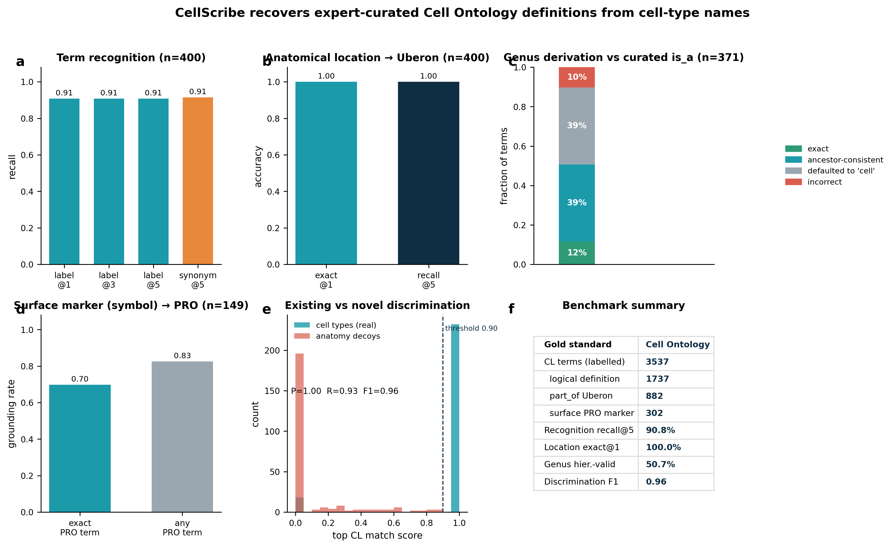
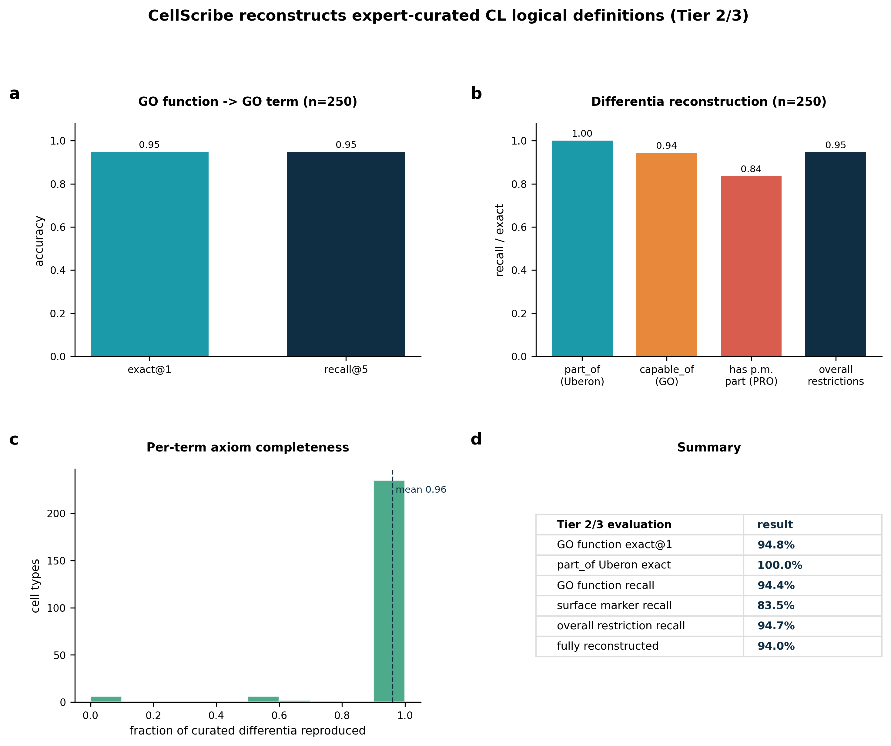

# CellScribe — a grounded, agentic assistant for Cell Ontology curation

CellScribe takes a cell type (a name, optionally a description, marker genes and an
expression matrix) and returns a **curation dossier**: grounded ontology terms,
a tested marker panel, cited literature, a *computable* draft definition
(OWL + ROBOT), and the agent's own critique + recommended disposition —
so a curator reviews **evidence and doubts, not an unverified answer**.

It is inspired by Stanford's **Biomni** (a general-purpose biomedical agent =
an *environment* of tool schemas + an *agent* that retrieves, plans, executes
and self-critiques), narrowed to the Cell Ontology curation loop and wired to
public resources (EBI OLS, Europe PMC).

> **Design bet:** LLMs are strong drafters but weak authorities. So every claim
> is grounded in a real CURIE (EBI OLS) and a real paper (Europe PMC), markers
> are tested on data, and nothing is committed without a human. The LLM is
> optional and may only *plan* and *polish* — never invent an ontology term.

---

## Quickstart

```bash
pip install -r requirements.txt          # requests (+ pandas/numpy for the marker test)
# or: pip install -e .                    # gives a `cellscribe` command

python run_demo.py                        # OFFLINE by default (uses shipped fixtures)
python run_demo.py --online               # refresh from EBI OLS / Europe PMC
python -m cellscribe.cli tools                 # list the tool registry
python -m cellscribe.cli curate --name "..." --markers GENE1,GENE2 --location "..." --out out/
```

See **[`examples/`](examples/)** for runnable scripts and **[Tests](#tests)** below.

---

## What it does (verified, live)

```
$ python -m cellscribe.cli curate --name "striatal parvalbumin-positive GABAergic interneuron" \
      --description "A GABAergic interneuron of the striatum expressing parvalbumin" \
      --markers GAD1,GAD2,PVALB --location striatum \
      --expr demo_data/striatum_demo_expr.csv --target striatal_PV_interneuron --out out/

  [1] retrieval        selected tools — literature_search, marker_panel, ols_search, draft_definition
  [2] planner          planned steps — ols_search -> literature_search -> marker_panel -> draft_definition
  [3] ols_search       existing-term check in CL — no CL match
  [4] ols_search       ground parent/genus in CL — interneuron (CL:0000099) 1.00
  [5] ols_search       ground location in Uberon — striatum (UBERON:0002435) 1.00
  [6] literature_search Europe PMC evidence — 5 papers
  [7] marker_panel     test marker specificity — panel=[GAD2, PVALB, GAD1] score=1.00 (NS-Forest-style)
  [8] draft_definition compose text + OWL + ROBOT — An interneuron located in the striatum expressing ...
  [9] critic           verification & confidence — confidence=1.00

Verdict : PROPOSE new term for curator approval   (a human makes the final call)
```

Each dossier is written in the formats CL editors actually ingest: **JSON · Markdown ·
ROBOT template · OWL/Manchester · KGCL · MIRACL · a pre-filled GitHub new-term issue ·
SSSOM (when aligning) · KG triples**. Example computable draft:

```
Class: CL:NEW_0000001   # "striatal parvalbumin-positive GABAergic interneuron"
  EquivalentTo:
    'interneuron'
      and ('part of' some 'striatum')
      and ('expresses' some GAD2)
      and ('expresses' some PVALB)
      and ('expresses' some GAD1)
```

Two behaviours worth seeing in the demo:
* **Existing type → “ALIGN, don’t create.”** `CD4-positive, alpha-beta T cell`
  is recognised as `CL:0000624` and flagged as a duplicate.
* **Novel type → grounded proposal.** the striatal interneuron above is drafted
  with a data-tested marker panel and routed for approval.

---

## Architecture (Biomni-inspired)

```
                    ┌──────────────────────── CuratorAgent (A1-style) ───────────────────────┐
   CurationRequest  │  retrieve tools ▸ plan ▸ execute (grounded) ▸ self-correct ▸ critique   │  CurationDossier
  (name, markers,   │        │            │          │                    │          │        │  (JSON / Markdown /
   matrix, ...)  ───►        ▼            ▼          ▼                    ▼          ▼        ├──►  ROBOT / OWL +
                    │   registry     LLM plan   tool calls          re-derive    confidence  │     full trace)
                    │   .select()   (optional)  (below)             genus once   + disposition│
                    └────────────────────────────────┬───────────────────────────────────────┘
                                                      ▼
   Tool registry (declarative schemas):
     • ols_search        EBI OLS4      → ground CL / Uberon / GO / PR terms  (anti-hallucination)
     • literature_search Europe PMC    → papers + extracted evidence sentence (RAG)
     • marker_panel       numpy/pandas  → NS-Forest-style minimal, specific panel + F-beta score
     • go_marker_support  QuickGO       → GO × marker intersection (evidence ECO:0000269/0000318)
     • draft_definition   templating    → genus-differentia + OWL (part of / capable of /
                                          has plasma membrane part / expresses) + ROBOT row
     • critic             rules         → grounding/duplication/support checks → confidence + flags
```

| Biomni | CellScribe |
|---|---|
| Biomni-E1 environment (150 tools / 59 DBs) | `registry.py` — tool schemas over OLS, Europe PMC, NS-Forest-style analysis |
| Biomni-A1 retrieval → plan → code → self-critique | `agent.py` — `select()` → `plan_tools()` → grounded execution → `critic` |
| Declarative tool schemas | `ToolSpec` on every tool |
| Grounding to curb hallucination | every term is a real CURIE; the LLM never invents terms |

---

## Optional LLM (planner / polisher)

CellScribe is *useful without an LLM*. With a key it adds two judgement tasks —
ordering tools and polishing prose — but never invents ontology terms.

```bash
export ANTHROPIC_API_KEY=...   # or OPENAI_API_KEY=...
export CELLSCRIBE_MODEL=claude-sonnet-5   # optional
python -m cellscribe.cli curate --name "..." --markers ...      # (omit --no-llm)
```

**Offline / air-gapped:** `CELLSCRIBE_OFFLINE=1` forces cache-only using the shipped
`demo_data/fixtures/`, so the demo and tests run with no network.

---

## Examples

Runnable, offline (they use the shipped fixtures):

```bash
python examples/01_curate_api.py       # programmatic API: request -> dossier
python examples/02_marker_matrix.py    # NS-Forest-style marker test on a matrix
```

See **[`examples/README.md`](examples/README.md)** for a walk-through.

## Tests

No pytest required — the suite self-runs and is also pytest-compatible:

```bash
python tests/test_cellscribe.py     # -> "N passed" (offline, deterministic)
# or, if you have pytest:
pytest -q
```

The tests cover ontology grounding, the marker panel, definition drafting, the
critic's disposition logic, the query cascade, and the parent word-boundary fix,
plus two end-to-end agent runs (align-existing and propose-new) — all offline.

---

## Benchmark vs the manually-curated Cell Ontology

CellScribe is evaluated against **CL's own expert-curated logical definitions** (3,537 terms;
882 with `part_of` Uberon, 302 with PRO surface markers) as the gold standard. Full methods,
per-term results and reproduction are in **[`benchmark/RESULTS.md`](benchmark/RESULTS.md)**.



| Metric (n) | Result |
|---|---|
| Term recognition, recall@5 — name → CL CURIE (n=400) | **90.8%** (91.5% via synonyms) |
| Anatomical location → Uberon, exact@1 (n=400) | **100%** |
| Existing-vs-novel discrimination (n=500) | **P 1.00 · R 0.93 · F1 0.96** |
| Surface marker (bare symbol) → PRO, exact (n=149) | **69.8%** (82.6% any PRO) |
| Genus derivation, hierarchically-valid (n=371) | **50.7%** — honest weak spot → roadmap |

**Tier 2/3 — reconstructing full curated logical definitions** (`benchmark/figures/benchmark_figure2.png`):



| Tier 2/3 metric (n=250) | Result |
|---|---|
| GO function → GO term, exact@1 | **94.8%** |
| Differentia recall — part_of Uberon / capable_of GO / hpmp PRO | **100% / 94.4% / 83.5%** |
| Overall differentia recall | **94.7%** |
| Expert-curated definitions fully reconstructed | **94.0%** (mean completeness 0.96) |

Reproduce:
```bash
curl -sL http://purl.obolibrary.org/obo/cl.json -o cl-full.json
CL_JSON=cl-full.json python benchmark/run_benchmark.py && python benchmark/make_figures.py
```

---

## Biologically grounded (Tan et al. 2026, *The Cell Ontology in the age of single-cell omics*)

- **Genus–differentia** logical definitions (the CL design pattern), meant to be classified by a reasoner.
- **Anatomical location** → `part of` (BFO:0000050) Uberon; **GO function** → `capable of` (RO:0002215) a GO biological process.
- **Surface-protein markers** → `has plasma membrane part` some **PRO** (RO:0002104) — the canonical CD4 T-cell form — while **transcriptomic markers** → `expresses` (RO:0002292). The paper stresses protein ≠ transcript, so CellScribe models them differently.
- **GO × marker intersection** (Fig 1 / Table 1): a marker also annotated to a *defining* GO function (QuickGO, manual evidence ECO:0000269/0000318) is flagged higher-confidence — e.g. *GAD1/GAD2* support "GABA biosynthetic process" while *PVALB* (an identification marker) does not.

## Design principles

1. **Grounding over generation** — terms from OLS, evidence from Europe PMC; the LLM plans/polishes only.
2. **Evidence & provenance are first-class** — the output is a dossier (markers, papers, CURIEs, confidence), not an answer.
3. **Human-in-the-loop** — CellScribe never writes to CL; it proposes a *disposition* (ALIGN / PROPOSE_NEW / INSUFFICIENT).
4. **Test, don't assert** — marker specificity is measured on data (NS-Forest-style), not claimed.
5. **Auditable** — every run emits a step-by-step trace.

## Use cases

* Extending CL with new types from single-cell / spatial atlas taxonomies (ground genus + location, test markers, draft OWL, route for approval).
* Triaging cluster annotations: is this type already in CL, or genuinely new?
* Seeding knowledge-graph edges — grounded CURIEs + relations (`part of`, `expresses`) are graph edges by construction.
* A teaching example of a grounded, verifiable agentic workflow.

## Roadmap status (grounded in the CL paper)

**Implemented — Tier 1 (biology):** genus-differentia definitions; GO functions via `capable of`
(RO:0002215); surface markers → `has plasma membrane part` (RO:0002104) some PRO vs
transcriptomic `expresses` (RO:0002292); GO × marker intersection (QuickGO, ECO:0000269/0000318);
CL house-style definition prompt.

**Implemented — Tier 2 (rigour):** marker precision/recall + species + anatomical **context**;
**taxon constraints** — organism → NCBITaxon + `present_in_taxon` (RO:0002175) and a broadly-conserved
location caveat; data-linked reference + T-type **hypothesis** framing; **T-type naming policy**
(parent + top markers, source name kept as synonym).

**Implemented — Tier 3 (workflow-native outputs):** **KGCL**, **MIRACL**, pre-filled **GitHub new-term
issue** (with ORCID), **SSSOM** mapping (align / cross-species), **KG-triple** export; a **GitHub Action**
(`.github/workflows/curate.yml`) that drafts a dossier on a `new term` issue (paper Fig 7 workflow).

**Genuinely remaining (needs heavier infra):** swap the NS-Forest re-implementation for the real
`nsforest` package on Scanpy/AnnData; add an **EL reasoner (ELK/WHELK)** to auto-classify drafts and
verify taxon constraints; SPIRES/OntoGPT-grade evidence extraction; round-trip ROBOT templates into a
live **ODK** repo; and integrate with (not duplicate) OntoGPT / DRAGON-AI / Aurelian.
